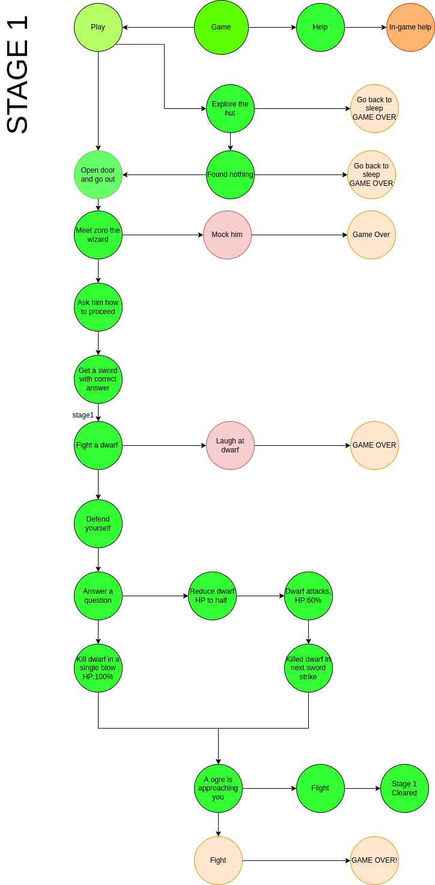

# Quizora: A fantasy quiz game

- Choice type interface with a fantasy based storyline
- Our hero is on a mission and on the way he’ll have to fight demons and collect various artifacts and weapons.
- To unlock more weapons, artifacts and spells, one has to answer various questions asked in the journey of the game. 
- Certain choices will only be unlocked if the player has certain weapons and artifacts and might change the course of the game.
- If there are more wrong answers than a certain threshold, the quest will end and player has to start again from the last savepoint.
- Also, while attacking bosses, correctly answered questions will unlock special combo and ultimate skills eventually dealing high damage.
- For all the questions answered correctly at a given point in game, bonus stages will be unlocked that’ll grant unique collectibles.
- Answering 5 questions incorrectly in a row will unlock GoldenDuck achievement.	
- In 10 stages of increasing difficulty, one who survives till the end will be declared winner.

.
